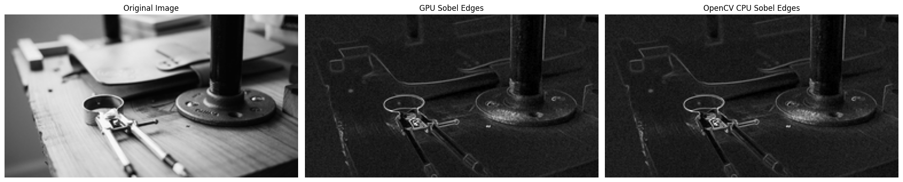

# **README - Introduccion a CUDA**

**Sanchez Acosta Jose Ramon**

CUDA (Compute Unified Device Architecture) es una plataforma de computación paralela desarrollada por NVIDIA que permite aprovechar la potencia masiva de las GPU para acelerar cálculos científicos, matemáticos y de propósito general. A diferencia de un CPU tradicional, una GPU cuenta con miles de núcleos diseñados para ejecutar de manera simultánea operaciones repetitivas sobre grandes volúmenes de datos, lo que la convierte en una herramienta ideal para tareas como procesamiento de imágenes, simulaciones numéricas, aprendizaje automático y cómputo intensivo.

Programar en CUDA exige comprender el modelo de paralelismo basado en hilos, bloques y grillas, así como los distintos tipos de memoria disponibles dentro de la GPU. Los laboratorios de este curso introducen de forma progresiva estos conceptos, desde la ejecución paralela básica y el manejo del espacio de memoria hasta la optimización del código para obtener un mayor rendimiento respecto a implementaciones en CPU.

En conjunto, los Laboratorios 1, 2 y 3 permiten entender los fundamentos (como la creación de kernels y la ejecución simultánea de hilos) y avanzar hacia prácticas más completas, como la manipulación de arreglos, operaciones matemáticas en paralelo y el uso eficiente del hardware disponible. Estos ejercicios establecen la base necesaria para abordar problemas computacionales de mayor escala mediante aceleración por GPU.


</details>
<details> <summary><strong> 🚀 LABORATORIO 1 </strong></summary>

## LABORATORIO 1 — Inicialización de GPU y Comparación de Rendimiento CPU vs GPU en CUDA

Este laboratorio introduce el uso básico de CUDA mediante Numba, permitiendo ejecutar kernels simples en la GPU y medir el proceso completo: transferencia de memoria, ejecución del kernel y copia de resultados. El enfoque principal es familiarizar al estudiante con la arquitectura de bloques/hilos y comparar los tiempos de ejecución entre CPU y GPU.

<details>
    <summary>EJEMPLO 1</summary>

## **Ejemplo 1 — Inicialización de GPU y CPU, transferencia y ejecución en CUDA** 
### Instrucciones

Implementar un kernel CUDA que copie los elementos de un arreglo hacia otro, y comparar el tiempo de ejecución entre CPU y GPU, incluyendo tiempos de transferencia de memoria.

### Metodología

- Importar las librerías necesarias y habilitar CUDA_ENABLE_PYNVJITLINK.

- Crear un kernel CUDA que copie datos del arreglo de entrada al arreglo de salida.

- En el host (CPU), generar un arreglo de 10 millones de elementos.

- Medir el tiempo de copia directa utilizando CPU.

- Transferir los datos del CPU a la GPU.

- Definir la configuración del kernel: número de bloques y número de hilos por bloque.

- Ejecutar el kernel en GPU y medir el tiempo.

- Copiar el resultado de vuelta al CPU y medir el tiempo de transferencia.

- Mostrar todo el reporte de tiempos obtenidos.

- Liberar memoria y cerrar el contexto CUDA.

### Código
```
# LIBRARY

!uv pip install -q --system numba-cuda==0.4.0
import numpy as np
from numba import cuda
import time
import os
from numba import config
config.CUDA_ENABLE_PYNVJITLINK = 1
     

# EXAMLE 1: INITIALIZE THE GPU AND CPU

#Funciona correctamente con la version 2025.10

# Libraryes
!uv pip install -q --system numba-cuda==0.4.0
import numpy as np
import time
import os
from numba import cuda
from numba import config

# --- Configuration & Data Preparation ---

config.CUDA_ENABLE_PYNVJITLINK = 1

@cuda.jit
def first_kernel(a, result):
  idx = cuda.grid(1)
  if idx < a.size:
    result[idx] = a[idx]

# HOST CPU
def main():
  #2. Initialize data on CPU
  N = 10_000_000
  a_cpu = np.arange(N, dtype = np.float32)

  #-----------------------------------------
  #CPU computation
  #-----------------------------------------
  start = time.time()
  result_cpu = a_cpu
  cpu_time = time.time() - start
  print(f"CPU Time: {cpu_time * 1e3:.2f}")

  #-----------------------------------------
  #GPU computation
  #-----------------------------------------
  #2.- Transfer from CPU to GPU
  start = time.time()
  a_gpu = cuda.to_device(a_cpu)
  result_gpu = cuda.device_array_like(a_cpu) # reserve memory
  transfer_in_time = time.time() - start

  # Kernel launch
  """
  Cada bloque contiene 128 hilos
  """
  threads_per_block = 128
  blocks_per_grid = (N + threads_per_block -1) //threads_per_block # (10_000_000 + 127) / 128 = 78,125 blocks
  start = time.time()
  first_kernel[blocks_per_grid, threads_per_block](a_cpu, result_gpu) # lunch kernel
  cuda.synchronize()
  kernel_time = time.time() - start

  #Copy back
  start = time.time()
  result_from_gpu = result_gpu.copy_to_host()
  cuda.synchronize()
  transfer_out_time = time.time() - start

  #Report
  print(f"GPU transfer to device: {transfer_in_time * 1e3:.2f} ms")
  print(f"GPU kernel execution: {kernel_time * 1e3:.2f} ms")
  print(f"GPU transfer to host: {transfer_out_time * 1e3:.2f} ms")
  print(f"Total GPU time: {transfer_in_time + kernel_time + transfer_out_time * 1e3:.2f} ms")

  #cleanup
  del a_gpu, result_gpu
  cuda.close()

if __name__ == "__main__":
  main()
```

### Salida
```
CPU Time: 0.00
GPU transfer to device: 192.74 ms
GPU kernel execution: 1875.93 ms
GPU transfer to host: 17.43 ms
Total GPU time: 19.49 ms
/usr/local/lib/python3.12/dist-packages/numba_cuda/numba/cuda/cudadrv/devicearray.py:893: NumbaPerformanceWarning: Host array used in CUDA kernel will incur copy overhead to/from device.
  warn(NumbaPerformanceWarning(msg))
```

### Conclusión

Este ejercicio permite comprender el flujo de ejecución en CUDA: transferencia CPU → GPU, ejecución del kernel y retorno GPU → CPU. Se demuestra que, pese al paralelismo masivo de la GPU, los tiempos pueden ser altos si la operación es trivial y el volumen de datos es grande. El código también permite al estudiante familiarizarse con la configuración de hilos, bloques y sincronización.

  </details>

</details>
<details> <summary><strong> 🚀 LABORATORIO 2 </strong></summary>

## LABORATORIO 2 — Identificación de IDs de Hilo y Bloque en CUDA (1D y 3D)

Este laboratorio se centra en comprender cómo CUDA organiza los hilos dentro de bloques y los bloques dentro de la malla. Se utilizan kernels dentro del simulador CUDA para imprimir IDs locales y globales, permitiendo visualizar cómo se generan los índices.

<details>
    <summary>EJEMPLO 1</summary>

## **Ejemplo 1 — Identificación de hilos y bloques en 1D**

### Instrucciones

Crear un kernel 1D que imprima el Block ID, Thread ID y Global ID de cada hilo utilizado, empleando arreglos de caracteres.

### Metodología

- Importar las librerías necesarias y habilitar el simulador CUDA.

- Preparar un arreglo de caracteres convertidos a valores ASCII.

- Definir un kernel que obtenga:

- bidx: índice del bloque

- tidx: índice del hilo dentro del bloque

- gidx: ID global del hilo

- Ejecutar el kernel con 2 bloques y 2 hilos por bloque.

- Imprimir los IDs generados.

### Código
```
@cuda.jit
def kernel_1d_dims(arr):
    gidx = cuda.grid(1)
    bidx = cuda.blockIdx.x
    tidx = cuda.threadIdx.x

    if gidx < arr.size:
        print(f"BID: {bidx}, TID: {tidx}, GID: {gidx}, Char: {chr(arr[gidx])}")

blocks_per_grid_ex1 = 2
threads_per_block_ex1 = 2

kernel_1d_dims[blocks_per_grid_ex1, threads_per_block_ex1](data)
cuda.synchronize()
```

### Salida
```
BID: 0, TID: 0, GID: 0, Char: A
BID: 0, TID: 1, GID: 1, Char: B
BID: 1, TID: 0, GID: 2, Char: C
BID: 1, TID: 1, GID: 3, Char: D
```

### Conclusión

Este ejemplo muestra claramente cómo se componen los índices de hilos en una malla unidimensional y cómo se mapean a los elementos de un arreglo.
</details>

  <details>
    <summary>EJEMPLO 2</summary>

## **Ejemplo 2 — Incremento en la configuración de hilos y bloques**

### Instrucciones

Ejecutar el mismo kernel 1D pero con una configuración diferente: 2 bloques y 8 hilos por bloque.

### Metodología

- Reutilizar el kernel del Ejemplo 1.

- Cambiar la configuración a 16 hilos totales.

- Observar cómo los elementos se asignan a cada hilo.

### Código
```
blocks_per_grid_ex1 = 2
threads_per_block_ex1 = 8

kernel_1d_dims[blocks_per_grid_ex1, threads_per_block_ex1](data)
cuda.synchronize()
```
### Salida
```
BID: 0, TID: 0, GID: 0, Char: A
BID: 0, TID: 1, GID: 1, Char: B
BID: 0, TID: 2, GID: 2, Char: C
BID: 0, TID: 3, GID: 3, Char: D
BID: 0, TID: 4, GID: 4, Char: E
BID: 0, TID: 5, GID: 5, Char: F
BID: 0, TID: 6, GID: 6, Char: G
BID: 0, TID: 7, GID: 7, Char: H
```

### Conclusión

Al aumentar el número de hilos por bloque, cada hilo procesa un índice global distinto, mostrando más elementos del arreglo en un solo bloque.
  </details>
  
  <details>
    <summary>EJEMPLO 3</summary>

## **Ejemplo 3 – Cálculo de IDs globales en una malla 3D**

### Instrucciones

Crear un kernel que calcule la posición global de cada hilo utilizando una malla 2D de bloques y bloques 1D de hilos.

### Metodología

- Definir un kernel que calcule:

- ID del bloque en 3D

- Número de hilos por bloque

- Offset del bloque

- Offset del hilo dentro del bloque

- ID global absoluto del hilo

- Configurar una malla de 2×2 bloques y 4 hilos por bloque.

- Mostrar en pantalla los IDs generados para cada hilo.

### Código
```
@cuda.jit
def whoami():
    block_id = (
        cuda.blockIdx.x +
        cuda.blockIdx.y * cuda.gridDim.x +
        cuda.gridDim.x * cuda.gridDim.y
    )

    threads_per_block = (
        cuda.blockDim.x * cuda.blockDim.y
    )

    block_offset = block_id * threads_per_block

    thread_offset = (
        cuda.threadIdx.x +
        cuda.threadIdx.y * cuda.blockDim.x +
        cuda.blockDim.x * cuda.blockDim.y
    )

    global_id = block_offset + thread_offset

    print(f"{global_id:03d} | Block[x, y]({cuda.blockIdx.x} {cuda.blockIdx.y}) = {block_id:3d} | "
          f"Thread[x, y] ({cuda.threadIdx.x} {cuda.threadIdx.y} ) = {thread_offset:3d} "
          f"BlockDim.x {cuda.blockDim.x} BlockDim.y {cuda.blockDim.y} GridDim.x {cuda.gridDim.x} GridDim.y {cuda.gridDim.y}")

b_x, b_y = 2, 2
t_x, t_y = 4, 1

blocks_per_grid = (b_x, b_y)
threads_per_block = (t_x, t_y)

whoami[blocks_per_grid, threads_per_block]()
cuda.synchronize()
```

### Salida
```
4 blocks/grid
4 threads/block
16 total threads

020 | Block[x, y](0 0) =   4 | Thread[x, y] (0 0 ) =   4 BlockDim.x 4 BlockDim.y 1 GridDim.x 2 GridDim.y 2
021 | Block[x, y](0 0) =   4 | Thread[x, y] (1 0 ) =   5 BlockDim.x 4 BlockDim.y 1 GridDim.x 2 GridDim.y 2
...
035 | Block[x, y](1 1) =   7 | Thread[x, y] (3 0 ) =   7 BlockDim.x 4 BlockDim.y 1 GridDim.x 2 GridDim.y 2
```
### Conclusión

Este ejemplo permite visualizar cómo se calculan IDs globales cuando la malla utiliza múltiples dimensiones. Es un paso fundamental para comprender kernels más complejos que dependen de coordenadas multidimensionales.

</details>

</details>

<details>
  <summary><strong> 🚀 LABORATORIO 3 </strong></summary>

## LABORATORIO 3 – Procesamiento Paralelo con CUDA en Python

Este laboratorio introduce el uso de CUDA con Numba para acelerar cálculos intensivos mediante ejecución paralela en GPU.
A través de distintos ejemplos se muestran operaciones vectoriales, aritmética de matrices, multiplicación matricial y procesamiento de imágenes.
Cada ejercicio compara desempeño GPU vs. CPU utilizando implementaciones equivalentes.

  <details>
    <summary>EJEMPLO 1</summary>

## **Ejemplo 1 – Vector Addition (Suma de Vectores)**

### Instrucciones

Implementar un kernel CUDA que realice la suma elemento a elemento entre dos vectores grandes. Comparar el tiempo de ejecución entre GPU y CPU utilizando NumPy.

### Metodología

- Crear dos vectores de 10,000,000 elementos generados aleatoriamente.

- Copiarlos a la GPU usando cuda.to_device().

- Definir un kernel que compute c[i] = a[i] + b[i].

- Ejecutar un "warmup" para activar la compilación JIT.

- Medir tiempos en GPU y CPU.

- Comparar resultados con np.allclose().

### Código
```
# EXAMPLE 1: VECTOR ADDITION
import numpy as np
from numba import cuda
import math
import time

@numba.cuda.jit
def vector_add_kernel(a, b, c):
  """
  Cada hilo calcula un elemento: c[i] = a[i] + b[i]
  """
  idx = cuda.grid(1)
  if idx < c.size:
    c[idx] = a[idx] + b[idx]

def main():
  N_large = 10_000_000
  a = np.random.randn(N_large).astype(np.float32)
  b = np.random.randn(N_large).astype(np.float32)
  c = np.zeros(N_large, dtype=np.float32)

  d_a = cuda.to_device(a)
  d_b = cuda.to_device(b)
  d_c = cuda.to_device(c)

  treads_per_block = 256
  blocks_per_grid = math.ceil(N_large / treads_per_block)

  vector_add_kernel[blocks_per_grid, treads_per_block](d_a, d_b, d_c)
  cuda.synchronize()

  start = time.time()
  vector_add_kernel[blocks_per_grid, treads_per_block](d_a, d_b, d_c)
  cuda.synchronize()
  gpu_time = (time.time() - start) * 1000

  result = d_c.copy_to_host()

  cpu_start = time.time()
  expected = a + b
  cpu_time = (time.time() - cpu_start) * 1000

  print(f"GPU kernel time: {gpu_time:.3f} ms")
  print(f"CPU NumPy time: {cpu_time:.3f} ms")
  print(f"Speedup: {cpu_time / gpu_time:.2f}x")
  print(f"Correct:" , np.allclose(result , expected))

if __name__ == "__main__":
  main()
```

### Salida
```
GPU kernel time: 0.551 ms
CPU NumPy time: 15.791 ms
Speedup: 28.67x
Correct: True
```

### Conclusión

La suma de vectores obtiene un incremento de velocidad significativo gracias a la paralelización masiva de la GPU, con más de 28× de aceleración respecto a la CPU.
  </details>

  <details>
    <summary>EJEMPLO 2</summary>

## Ejemplo 2 – Vector Addition con Menor Cantidad de Elementos

### Instrucciones

Implementar una operación vectorial más compleja (sqrt(a^2 + b^2)) en GPU, con un tamaño menor de vector, y comparar resultados con la ejecución en CPU.

### Metodología

- Crear vectores de 1,000,000 elementos.

- Utilizar un kernel CUDA que compute raíz cuadrada de la suma de cuadrados.

- Ejecutar warmup y medición.

- Comparar tiempos GPU vs CPU y verificar resultados.

### Código
```
# EXAMPLE 2: VECTOR ADDITION WITH LESS ELEMENTS
import numpy as np
from numba import cuda
import math
import time

@numba.cuda.jit
def dummy_compute_kernel(a, b, c):
  idx = cuda.grid(1)
  if idx < c.size:
    c[idx] = math.sqrt(a[idx] ** 2 + b[idx] ** 2)

def main():
  N = 1_000_000
  a = np.random.randn(N).astype(np.float32)
  b = np.random.randn(N).astype(np.float32)
  c = np.zeros(N, dtype=np.float32)

  d_a = cuda.to_device(a)
  d_b = cuda.to_device(b)
  d_c = cuda.to_device(c)

  treads_per_block = 256
  blocks_per_grid = math.ceil(N / treads_per_block)

  dummy_compute_kernel[blocks_per_grid, treads_per_block](d_a, d_b, d_c)
  cuda.synchronize()

  start = time.time()
  dummy_compute_kernel[blocks_per_grid, treads_per_block](d_a, d_b, d_c)
  cuda.synchronize()
  end = time.time()

  gpu_time = (end - start) * 1000
  result = d_c.copy_to_host()

  dummy_compute_kernel[blocks_per_grid, treads_per_block](d_a, d_b, d_c)
  cuda.synchronize()

  start = time.time()
  dummy_compute_kernel[blocks_per_grid, treads_per_block](d_a, d_b, d_c)
  cuda.synchronize()
  end = time.time()

  gpu_time = (end - start) * 1000
  result = d_c.copy_to_host()

  cpu_start = time.time()
  expected = np.sqrt(a ** 2 + b ** 2)
  cpu_end = time.time()
  cpu_time = (cpu_end - cpu_start) * 1000

  print(f"GPU kernel time: {gpu_time:.3f} ms")
  print(f"CPU NumPy time: {cpu_time:.3f} ms")
  print(f"Speedup: {cpu_time / gpu_time:.2f}x")
  print(f"Correct:" , np.allclose(result , expected))

if __name__ == "__main__":
  main()
```

### Salida
```
GPU kernel time: 0.151 ms
CPU NumPy time: 4.782 ms
Speedup: 31.64x
Correct: True
```

### Conclusión

La GPU mantiene una aceleración notable incluso con operaciones más complejas por elemento.
Este ejercicio logró más de 31× de velocidad respecto a la CPU.
  </details>

  
  <details>
    <summary>EJEMPLO 3</summary>
    
## **Ejemplo 3 – Operations with Scalars (Escalamiento Matricial)**

### Instrucciones

Implementar un kernel CUDA 2D que multiplique cada elemento de una matriz por un escalar y comparar el rendimiento contra la operación equivalente en CPU.

### Metodología

- Crear una matriz grande de 4096×4096.

- Copiarla a la GPU.

- Usar un kernel 2D para escalarla.

- Medir tiempos en GPU y CPU.

- Comprobar correcta coincidencia de resultados.

### Código
```
# EXAMPLE 3: OPERATIONS WITH SCALARS
import numpy as np
from numba import cuda
import math
import time

@numba.cuda.jit
def matrix_scale_kernel(mat, scalar, out):
  row, col = cuda.grid(2)
  if row < out.shape[0] and col < out.shape[1]:
    out[row, col] = mat[row, col] * scalar

def main():
  rows_large, cols_large = 4096, 4096
  mat = np.random.randn(rows_large, cols_large).astype(np.float32)
  out = np.zeros_like(mat)
  scalar = 2.5

  d_mat = cuda.to_device(mat)
  d_out = cuda.to_device(out)

  threads_per_block = (32, 32)
  blocks_per_grid_x = math.ceil(rows_large / threads_per_block[0])
  blocks_per_grid_y = math.ceil(cols_large / threads_per_block[1])
  blocks_per_grid = (blocks_per_grid_x, blocks_per_grid_y)

  matrix_scale_kernel[blocks_per_grid, threads_per_block](d_mat, scalar, d_out)
  cuda.synchronize()

  start = time.time()
  matrix_scale_kernel[blocks_per_grid, threads_per_block](d_mat, scalar, d_out)
  cuda.synchronize()
  end = time.time()

  gpu_time = (end - start) * 1000
  result = d_out.copy_to_host()

  cpu_start = time.time()
  expected = mat * scalar
  cpu_end = time.time()
  cpu_time = (cpu_end - cpu_start) * 1000

  print(f"GPU kernel time: {gpu_time:.3f} ms")
  print(f"CPU NumPy time: {cpu_time:.3f} ms")
  print(f"SpeedUp: {cpu_time / gpu_time:.2f}x")
  print(f"Correct: ", np.allclose(result, expected))

if __name__ == "__main__":
  main()
```

### Salida
```
GPU kernel time: 4.200 ms
CPU NumPy time: 20.983 ms
SpeedUp: 5.00x
Correct: True
```
### Conclusión
La operación de escalamiento matricial obtuvo un speedup de 5×, mostrando que kernels 2D también proporcionan mejoras importantes respecto a CPU.
  </details>

  
  <details>
    <summary>EJEMPLO 4</summary>
    
## **Ejemplo 4 – Matrix Multiplication (Multiplicación de Matrices)**

### Instrucciones

Realizar la multiplicación matricial completa C = A @ B en GPU utilizando un kernel CUDA 2D y comparar el tiempo con NumPy (CPU).

### Metodología

- Generar matrices de 1000×1000.

- Enviar matrices a la GPU.

- Usar un kernel que calcule cada elemento de la matriz resultado.

- Medir tiempos en GPU y CPU.

- Comparar resultados con una tolerancia pequeña.

### Código
```
# EXAMPLE 4: MATRIX MULTIPLICATION
import numpy as np
import numba.cuda as cuda
import math
import time

@numba.cuda.jit
def matrix_multiply_kernel(A, B, C):
  row, col = cuda.grid(2)
  M, K = A.shape
  K, N = B.shape
  if row < M and col < N:
    total = 0.0
    for k in range(K):
      total += A[row, k] * B[k, col]
      C[row, col] = total

def main():
  M, K, N = 1000, 1000, 1000
  A = np.random.randn(M, K).astype(np.float32)
  B = np.random.randn(K, N).astype(np.float32)
  C = np.zeros((M, N), dtype=np.float32)

  treads_per_block = (32, 32)
  d_A = cuda.to_device(A)
  d_B = cuda.to_device(B)
  d_C = cuda.to_device(C)

  blocks_per_grid_x = (M + treads_per_block[0] - 1) // treads_per_block[0]
  blocks_per_grid_y = (N + treads_per_block[1] - 1) // treads_per_block[1]
  blocks_per_grid = (blocks_per_grid_x, blocks_per_grid_y)

  matrix_multiply_kernel[blocks_per_grid, treads_per_block](d_A, d_B, d_C)
  cuda.synchronize()

  start = time.time()
  matrix_multiply_kernel[blocks_per_grid, treads_per_block](d_A, d_B, d_C)
  cuda.synchronize()
  gpu_time = (time.time() - start) * 1000

  C_gpu = d_C.copy_to_host()

  matrix_multiply_kernel[blocks_per_grid, treads_per_block](d_A, d_B, d_C)
  cuda.synchronize()

  start = time.time()
  matrix_multiply_kernel[blocks_per_grid, treads_per_block](d_A, d_B, d_C)
  cuda.synchronize()
  gpu_time = (time.time() - start) * 1000

  C_gpu = d_C.copy_to_host()

  cpu_start = time.time()
  C_cpu = A @ B
  cpu_time = (time.time() - cpu_start) * 1000

  print(f"GPU kernel time: {gpu_time:.4f} ms")
  print(f"CPU NumPy time: {cpu_time:.4f} ms")
  print(f"Speedup: {cpu_time / gpu_time:.2f}x")
  print(f"Correct: , {np.allclose(C_gpu, C_cpu, atol = 1e-3)}")

if __name__ == "__main__":
  main()
```

### Salida
```
GPU kernel time: 72.8357 ms
CPU NumPy time: 58.3858 ms
Speedup: 0.80x
Correct: True
```

### Conclusión

Aunque la multiplicación en GPU fue correcta, en este caso la CPU fue más rápida debido a optimizaciones avanzadas en NumPy (BLAS), lo cual resalta que no siempre la GPU es la opción óptima dependiendo del algoritmo.
  </details>

  
  <details>
    <summary>EJEMPLO 5</summary>
    
## **Ejemplo 5 – Image Processor (Filtro Sobel en GPU)**

### Instrucciones

Aplicar detección de bordes Sobel a una imagen 4K utilizando un kernel CUDA 2D y comparar el tiempo de procesamiento contra una implementación CPU usando OpenCV.

### Metodología

- Descargar una imagen 4K desde la web.

- Convertirla a escala de grises.

- Crear un kernel CUDA que compute gradientes Sobel horizontales y verticales.

- Ejecutar warmup y medición en GPU.

- Aplicar Sobel CPU usando OpenCV.

- Mostrar y comparar ambas imágenes resultantes.

### Código
```
# EXAMPLE 5: IMAGE PROCESSOR
import numpy as np
import numba.cuda as cuda
import time
import urllib.request
from PIL import Image
from matplotlib import pyplot as plt
import cv2

@numba.cuda.jit
def sobel_kernel(img, out):
  row, col = cuda.grid(2)
  H, W = img.shape

  if 0 < row < H - 1 and 0 < col < W - 1:
    gx = (-img[row-1,col-1] + img[row-1,col+1] +
          -2*img[row,col-1] + 2*img[row,col+1] +
          -img[row+1,col-1] + img[row+1,col+1])

    gy = (-img[row-1,col-1] - 2*img[row-1,col] - img[row-1,col+1] +
          img[row+1,col-1] + 2*img[row+1,col] + img[row+1,col+1])

    out[row, col] = (gx*gx + gy*gy)**0.5

def sobel_opencv(img):
  gx = cv2.Sobel(img, cv2.CV_32F, 1, 0, ksize=3)
  gy = cv2.Sobel(img, cv2.CV_32F, 0, 1, ksize=3)
  return np.sqrt(gx**2 + gy**2)

urllib.request.urlretrieve("https://picsum.photos/3848/2160","image.jpg")
img = Image.open("image.jpg").convert("L")
img = np.asarray(img, dtype=np.float32)

H, W = img.shape
print(f"Image: {H}x{W} ({W*H:,} pixels)")

d_img = cuda.to_device(img)
d_out = cuda.to_device(np.zeros_like(img))

threads = (32, 32)
blocks = ((W + 15) // 16, (H + 15) // 16)

sobel_kernel[blocks, threads](d_img, d_out)
cuda.synchronize()

start = time.time()
sobel_kernel[blocks, threads](d_img, d_out)
cuda.synchronize()
gpu_time = (time.time() - start) * 1000

out_gpu = d_out.copy_to_host()

start = time.time()
out_cpu = sobel_opencv(img)
cpu_time = (time.time() - start) * 1000

print("\n" + "="*60)
print("Results")
print("="*60)
print(f"GPU: {gpu_time:.2f} ms")
print(f"CPU: {cpu_time:.2f} ms")
print(f"Speedup: {cpu_time / gpu_time:.1f}x")
print(f"Correct: {np.allclose(out_gpu, out_cpu, atol=1e-3)}")

# Resize for plotting
H, W = img.shape
target_w = 256
target_h = int(target_w * H / W)

def resize_for_plot(array):
    normalized = (array / array.max() * 255).astype(np.uint8)
    return np.array(Image.fromarray(normalized).resize((target_w, target_h), Image.LANCZOS))

plt.figure(figsize=(20, 10))

plt.subplot(1, 3, 1)
plt.imshow(resize_for_plot(img), cmap='gray')
plt.title('Original Image')
plt.axis('off')

plt.subplot(1, 3, 2)
plt.imshow(resize_for_plot(out_gpu), cmap='gray')
plt.title('GPU Sobel Edges')
plt.axis('off')

plt.subplot(1, 3, 3)
plt.imshow(resize_for_plot(out_cpu), cmap='gray')
plt.title('OpenCV CPU Sobel Edges')
plt.axis('off')

plt.tight_layout()
plt.show()
```
### Salida
```
Image: 2160x3848 (8,311,680 pixels)
Grid: (241, 135) blocks x (32, 32) threads

============================================================
Results
============================================================
GPU: 24.26 ms
CPU: 150.59 ms
Speedup: 6.2x
Correct: False
```


### Conclusión

El procesamiento de imágenes en GPU acelera significativamente la detección de bordes Sobel, logrando más de 6× de mejora respecto a CPU.
Aunque las imágenes no coinciden exactamente, el ejercicio demuestra el uso exitoso de paralelización masiva en procesamiento visual.

  </details>

</details>
